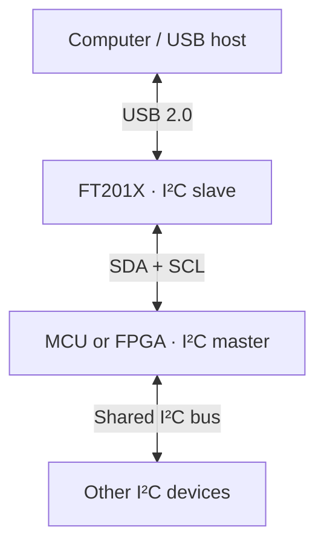

# USB-to-I²C Converter | FT201X

A compact USB interface for an embedded system with an I²C master. The board uses an **FTDI FT201X** to exchange data between a USB host and a microcontroller or FPGA over I²C. Its USB Type-C connector provides the USB 2.0 connection to the computer.

> **Direction matters:** The FT201X is an **I²C slave**. It cannot act as an I²C master to scan or read sensors directly. Your microcontroller or FPGA initiates every I²C transfer.

## Project status

The PCB has been assembled and tested, according to the project notes. Specific measurements, firmware, and test logs have not been included here.

## How it works

The master can address the FT201X and other slaves on the same bus, provided each slave has a unique address and the devices share compatible I/O levels. For example, to bring sensor readings to a PC, the MCU reads the sensor and writes the result to the FT201X; the FT201X sends those bytes over USB. The PC can send commands in the other direction for the MCU to read.

This is a **USB connection for an I²C-master system**, not a PC-controlled general-purpose I²C master adapter.

## Hardware overview

| Item | Implementation / purpose |
| --- | --- |
| Bridge | FTDI FT201X, USB 2.0 full speed to I²C slave |
| USB connector | USB Type-C, wired for USB 2.0 device operation |
| USB protection | ESD protection on D+ and D−; 27 Ω series resistors in the USB data paths |
| I²C connection | SDA and SCL with pull-up resistors; MCU/FPGA provides the clock |
| I/O supply | VCCIO sets the FT201X interface voltage; match it to the I²C bus |
| Other signals | Reset and configurable CBUS signals available on the board |
| Power | USB bus power with local decoupling and bulk capacitance |

The USB Type-C connection uses both orientations of D+ and D− and separate pull-down resistors on CC1 and CC2. Check the schematic for exact values, connector pinout, headers, and power options before connecting external hardware.

## I²C address and speed

- The FT201X factory-default **7-bit address is `0x22`**. An MCU library normally expects this 7-bit value, not the shifted address bytes (`0x44` for write and `0x45` for read).
- The address is configurable in FT201X nonvolatile settings, so check the programmed configuration if a scanner does not find `0x22`.
- Start bus bring-up at **100 kHz**; try **400 kHz** after basic transfers work. The FT201X supports faster I²C modes, but the selected rate and pull-ups must also work for every other device and the bus wiring.
- The USB serial port baud setting does **not** set the I²C clock. The I²C master generates SCL.

## Bring-up

1. With power off, check for shorts between supply and ground and confirm the intended VCCIO and pull-up voltage.
2. Connect USB and confirm the FT201X enumerates on the computer. Use FTDI's **FT_PROG** if you need to inspect its programmed settings.
3. Connect a common ground, SDA, and SCL to an I²C-master MCU. Avoid connecting an incompatible-voltage bus directly.
4. Set the MCU bus to 100 kHz and scan for the configured FT201X address (`0x22` by default).
5. Test bytes in **both** directions: PC → FT201X → MCU and MCU → FT201X → PC. Use the FT201X transfer protocol in the datasheet when writing firmware.
6. Add any sensors after the bridge works; check that their addresses do not conflict.

For PC-side testing, install the applicable FTDI driver. If the device appears as a virtual COM port, a serial terminal or `pyserial` can send and receive bytes. Define framing and commands in the MCU firmware; the FT201X does not automatically turn sensor data into text lines.

## If communication fails

| Symptom | Check |
| --- | --- |
| No USB device | USB cable and connector, VBUS, supply rails, reset, D+/D− wiring and ESD parts |
| No I²C acknowledgement | Master mode, common ground, SDA/SCL wiring, pull-ups, VCCIO, configured address |
| Intermittent transfers | Pull-up strength, bus capacitance, clock rate and shared-device loading |
| USB works but no sensor data | MCU firmware, FT201X read/write sequence and sensor address |

## Reference

- [FTDI FT201X product documentation](https://ftdichip.com/products/ft201xq/)

## Author

**Nishant Patil**

No license has been specified for the project files. Add a license file when you decide how others may use the design.
